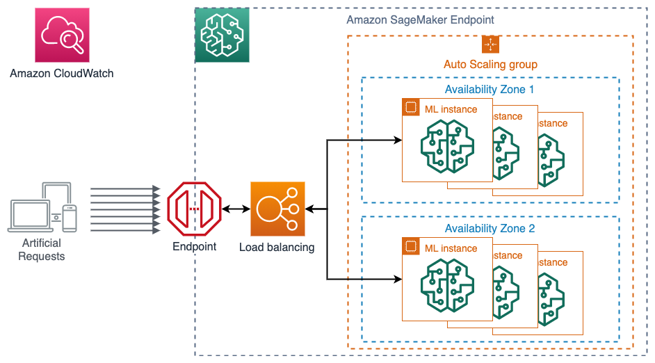

# Achieve high performance and cost-effective model deployment
Welcome to reInvent 2021 AIML session 408 **Achieve high performance and cost-effective model deployment**. 

Imagine you have a use case where you are creating numerous models by geographic area in order to have a more localized understanding and prediction of your customer’s behavior. While you can host each model in one endpoint, you will soon dealing with management overhead and start burning budgets. Also you need to make sure you are using the right compute instance count and type to host the models optimally so that you are serving all requests under satisfactory latency while not over provisioning for unused capacity.


In this demo, we show you how you can optimize your model deployment for cost and performance when you need to host 50+ ML models following the guidance we discussed in the session, shown as a decision tree below. 


We use a synthetic telecommunication customer churn dataset as our sample use case. The dataset contains customer phone plan usage, account information and their churn status, whether customer would stay or leave the plan. We use SageMaker's built-in XGBoost algorithm which is suitable for this structured data. To make the model prediction more localized and improve the model accuracy, we train one model for customers in one State. In the end we have 50+ ML models based on SageMaker's XGBoost framework. According to the chart above, it is more cost effective to host these models in a SageMaker Multi-model endpoint to predict customer churn instead of 50+ individual SageMaker real-time endpoints.


To analyze how our models perform under given compute infrasture and to optimize it, we host two multi-model endpoints on two instance types with different compute capacity and compare the performance with a load test using Locust, a load-testing framework in python, in order to find out an optimal hosting configuration. 



We will then analyze the load testing results in Amazon CloudWatch.


In this repository, the code is provided for you to replicate the demo in the session. You are welcome to clone the repository while you follow the session. This README provides end-to-end instruction to run the demo. You can find the following sections:

- [Prerequisite](#Prerequisite)
- [Model training and deployment in Amazon SageMaker Studio](#model-training-and-deployment-in-amazon-sagemaker-studio)
- [Load testing](#load-testing)
- [Analyze load testing results](#analyze-load-testing-results)
- [High availability](#high-availability)
- [Autoscaling](#autoscaling)
- [Cleaning up](#cleaning-up)
- [Additional resources](#additional-resources)

## Prerequisite
This demo runs the notebook for training and hosting on Amazon SageMaker Studio, and performs the load testing in AWS Cloud9. You can alternative setup the load testing on your local computer. 

To create an Amazon SageMaker Studio domain, you can follow the documentation pages: [Set Up Amazon SageMaker Prerequisites](https://docs.aws.amazon.com/sagemaker/latest/dg/gs-set-up.html) and [Onboard to Amazon SageMaker Domain](https://docs.aws.amazon.com/sagemaker/latest/dg/gs-studio-onboard.html).

To create an AWS Cloud9 environment for load testing, you can follow the instruction in [Tutorial: Hello AWS Cloud9 (console)](https://docs.aws.amazon.com/cloud9/latest/user-guide/tutorial.html). Because the distributed load testing is a CPU intensive task, we developed the load testing using c5.2xlarge (8 vCPU and 16 GB RAM).

To run the load testing in your local computer, make sure you configure your local AWS credential through AWS Command Line Interface (AWS CLI) with an IAM user profile that has permissions to invoke SageMaker endpoints. You can follow [Quick configuration with aws configure](https://docs.aws.amazon.com/cli/latest/userguide/cli-configure-quickstart.html#cli-configure-quickstart-config) to setup your credential. You need `sagemaker:InvokeEndpoint*` permission in your IAM user.

Clone this repository into SageMaker Studio and Cloud9 using a terminal.

```shell
git clone <github-url>
```

The load testing uses the distributed load testing framework: [Locust](https://docs.locust.io/en/stable/index.html)>=2.4.1.

## Model training and deployment in Amazon SageMaker Studio
Please follow the instruction in the notebook [churn-mme.ipynb](./churn-mme.ipynb) to prepare the data, train models, and host two multi-model endpoints in SageMaker.

## Load testing
Once the two endpoints are up and running, we can proceed to conduct load testing. Load testing related code is in [load-testing](./load-testing/) directory in the repo. 

To start we need to get the test data to the instance in the terminal, 

```shell
cd ./load-testing/
aws s3 cp s3://sagemaker-<region>-<account-id>/sagemaker/reinvent21-aim408/churn-mme/churn_data/churn_test.csv ./churn_test.csv
```

We can then launch two simultaneous distributed load testings, one for each endpoint. Let's create another terminal so we can start the two together. In the terminals, enter the commands with the two endpoint names (not ARN):

```shell
# In terminal 1
./launch_load_testing.sh ${sagemaker_endpoint_name_c5_xl} 8080
```

```shell
# In terminal 2
./launch_load_testing.sh ${sagemaker_endpoint_name_c5_2xl} 8081
```

as shown in the bottom of the figure below.


Each shell script starts a 2-worker distributed load testing job that creates 300 online users, with a spawn rate of 5 new users per second, hitting the respective endpoint for 15 minutes. The behavior of the ML inference is defined in [locustfile.py](./load-testing/locustfile.py). Each online user would randomly load a data point from the testing set we held out, and request against the state corresponding model in the multimodel endpoint for a prediction. We then use invoke_endpoint API from `boto3`'s `sagemaker-runtime` client to make invocation. The response status of the invocation is captured by `Locust` for summary. We specify the target model by `TargetModel` argument. And The target model is determined by `State` column in each data point.

[opening locust's UI]

## Deploying endpoint metric dashboard in Amazon CloudWatch
SageMaker endpoints, including multimodel endpoint, integrates with Amazon CloudWatch and emits metrics that captures the health and the statistics of an endpoint to Amazon CloudWatch at a 1-min frequency. We can visualize the metrics in Amazon CloudWatch directly, like in the dashboard we showed [previously](#cw-dashboard). 

We prepare the dashboard in a CloudFormation template for you to easily install.

[](https://console.aws.amazon.com/cloudformation/home?region=us-east-1#/stacks/new?templateURL=https://raw.githubusercontent.com/aws-samples/reinvent2021-aim408-high-performance-cost-effective-model-deployment-amazon-sagemaker/main/cloudformation/create-cw-dashboard.yaml)

^^ *Note the URL above is not working until the repo is created.*

*Note that the link above takes you to us-east-1 AWS Region. The dashboard assumes the metrics and endpoints are in the same AWS Region where you deployed the CloudFormation stack. Therefore, make sure to switch to the AWS Region where your endpoints are hosted.*

1. In the **Specify template** section, choose Next.
1. In the **Specify stack details** section, for **Stack name**, enter a name, provide the names to the two endpoints we hosted, and choose **Next**.
1. In the **Configure stack options** section, choose **Next**.
1. In the **Review** section, select **I acknowledge that AWS CloudFormation might create IAM resources** and choose **Next**.
1. When the stack status changes to `CREATE_COMPLETE`, go to the **Resources** tab to find the dashboard created.

Alternatively, you can create the stack using AWS Command Line Interface (AWS CLI). Again, make sure to deploy the stack in the AWS Region where your endpoints are hosted.

```shell
aws cloudformation create-stack --region ${AWS_Region} --stack-name cw-dashboard \
     --template-body file://cloudformation/create-cw-dashboard.yml \
     --parameters ParameterKey=EndpointC5XL,ParameterValue=${sagemaker_endpoint_name_c5_xl} \
                  ParameterKey=EndpointC52XL,ParameterValue=${sagemaker_endpoint_name_c5_2xl} 
```

You will get a response like below.

```
{
    "StackId": "arn:aws:cloudformation:<region>:<account-id>:stack/cw-dashboard/5616f040-4255-11ec-8b9b-12e592422393"
}
```

The dashboard deployed from the stack comes with a name like **MMECloudWatchDashboard-xxxxxxxxx** and can be accessed in [Amazon CloudWatch console](https://console.aws.amazon.com/cloudwatch/home?region=us-east-1#dashboards:).


## Analyze load testing results
This dashboard in Amazon CloudWatch displays the key metrics and charts from the two multi-model endpoints under load. The top half is the results from the `ml.c5.2xlarge` instance while the bottom half is from the smaller instance, prefixed with c5.xl-*. We highlighted the latest rolling averages as a banner on top of the time series metrics. Three main categories of metrics are displayed: 

1. invocation metrics (including errors);
2. latency metrics (model invocation latency and MME related latencies);
3. instance metrics (CPU/RAM utilization).

We can quickly observe a couple of things happening from 300 simultaneous artificial users hitting each endpoint: 

1. There are close to more invocations allowed on `ml.c5.2xlarge` instance, meaning a higher throughput; 
2. The model latency in the larger instance is lower than that of the smaller instance; 
3. All 51 models are loaded into memory in the larger instance while only a subset of models loaded in memory on the c5.xl instance as “hot” models for invocation. 
4. As a consequence, there is a constant loading and unloading of models in and out of the memory which takes close to 800ms on the smaller instance. There is also a whopping 3 seconds long model loading wait time, which indicates how much time in average an invocation has to wait MME to load a model for inference.
5. CPU/RAM utilization are different too. The smaller instance constantly going beyond 100% CPU utilization, attributed to longer latency. And there is a much higher RAM utilization, preventing MME to load more models into memory.

Comparing the performance and characteristic of the two endpoints, we can conclude that the `ml.c5.2xlarge` instance gives a better/stable throughput, and lower latency when there is max 300 simultaneous users calling the endpoint compared to using a `ml.c5.xlarge` instance. Using one single `ml.c5.2xlarge` instance allows us to serve all 51 models without constant loading/unloading, and maintain a desired single digit milisecond latency. We don’t need to host 51 endpoints/instances, hence a significant cost saving.

## High Availability
It is important to create a robust endpoint when hosting your model. SageMaker endpoints can help protect your application from Availability Zone outages and instance failures. If an outage occurs or an instance fails, SageMaker automatically attempts to distribute your instances across Availability Zones. For this reason, we strongly recommended that you deploy multiple instances for each production endpoint which will be automatically spread across Availability Zones.

If you are using an Amazon Virtual Private Cloud (VPC), configure the VPC with at least two Subnets, each in a different Availability Zone. If an outage occurs or an instance fails, Amazon SageMaker automatically attempts to distribute your instances across Availability Zones.

## Autoscaling
The benchmarking above is conducted based on single instance performance. We can treat that as a baseline performance and start scaling out the load and the number of instances. We can also apply Autoscaling policy to the endpoint any time, as shown in Autoscaling section in the [notebook](./churn-mme.ipynb). Then you should conduct the load testing again to verify that the load would indeed trigger the Autoscaling policy and that the policy is appropriate to the load under the experimentation, in addition to the measuring the endpoint performance.

## Cleaning up
You are reaching the end of the demo. After the demo, please delete all the SageMaker endpoints (last step in the [notebook](./churn-mme.ipynb)) and resources created by the CloudFormation stack from the [CloudFormation console](https://console.aws.amazon.com/cloudformation/home?region=us-east-1#/stacks) and Cloud9 instance to avoid incurring unnecessary cost. 

## Additional resources
While this talk and demo focus on choosing a SageMaker model hosting option and an optimal instance type, There are many great topics and solutions around achieving high performance and cost-effective model deployment.

- [Reduce ML inference costs on Amazon SageMaker with hardware and software acceleration](https://aws.amazon.com/blogs/machine-learning/reduce-ml-inference-costs-on-amazon-sagemaker-with-hardware-and-software-acceleration/)
- [Maximize TensorFlow performance on Amazon SageMaker endpoints for real-time inference](https://aws.amazon.com/blogs/machine-learning/maximize-tensorflow-performance-on-amazon-sagemaker-endpoints-for-real-time-inference/)
- [Choose the best AI accelerator and model compilation for computer vision inference with Amazon SageMaker](https://aws.amazon.com/blogs/machine-learning/choose-the-best-ai-accelerator-and-model-compilation-for-computer-vision-inference-with-amazon-sagemaker/)
- [Run computer vision inference on large videos with Amazon SageMaker asynchronous endpoints](https://aws.amazon.com/blogs/machine-learning/run-computer-vision-inference-on-large-videos-with-amazon-sagemaker-asynchronous-endpoints/)
- [A complete guide to AI accelerators for deep learning inference — GPUs, AWS Inferentia and Amazon Elastic Inference](https://towardsdatascience.com/a-complete-guide-to-ai-accelerators-for-deep-learning-inference-gpus-aws-inferentia-and-amazon-7a5d6804ef1c)

## Security

See [CONTRIBUTING](CONTRIBUTING.md#security-issue-notifications) for more information.

## License

This library is licensed under the MIT-0 License. See the [LICENSE](./LICENSE) file.